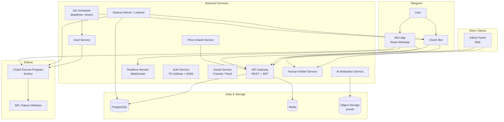
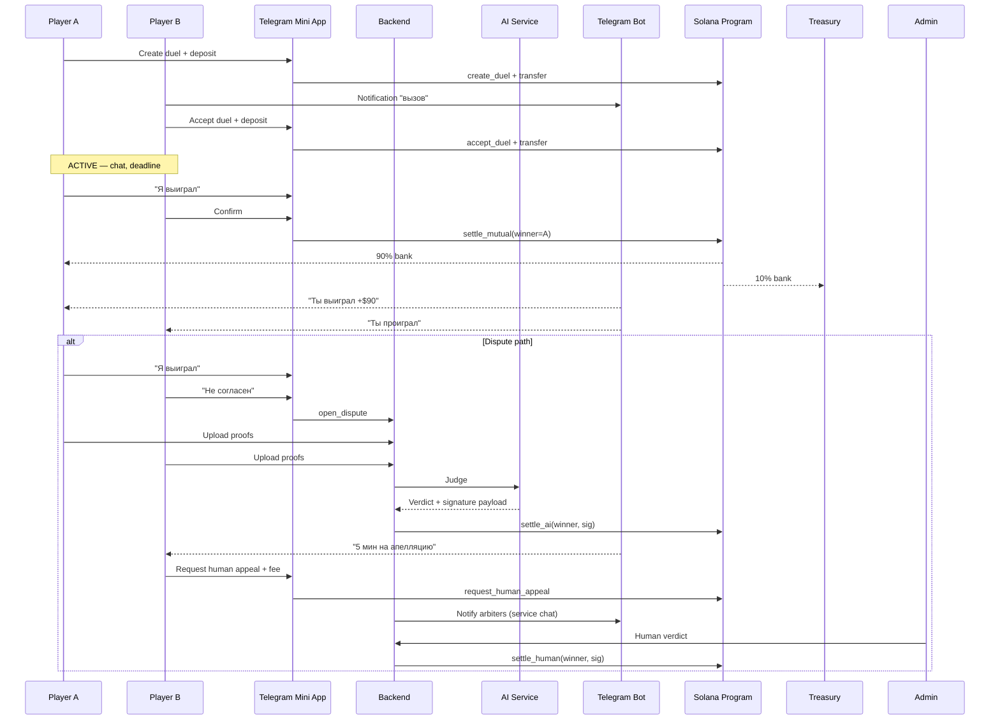
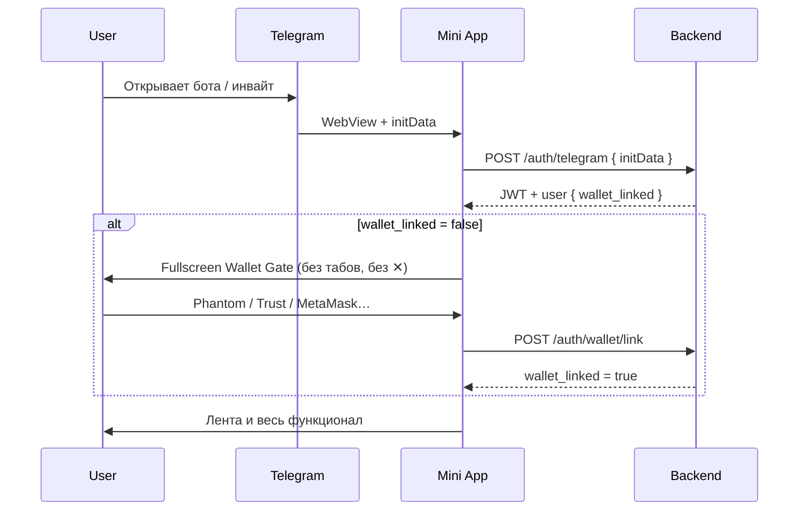

# CLUTCH — Architecture & Roadmap

> **Версия:** 0.5 (MVP)  
> **Дата:** 2026-05-24  
> **Статус:** Source of truth для разработки  
> **Дизайн:** `clutch-design-spec.html`, `clutch-feed-spec.html`

---

## 1. Продуктовые решения (зафиксировано)

| Тема | Решение |
|------|---------|
| Платформа | **Telegram Mini App** (WebView внутри Telegram) + **Telegram Bot** |
| Блокчейн | **Solana** (одна сеть) |
| Валюта в UI | **USD ($)** — все суммы отображаются в долларах |
| Ставки | Любой токен из whitelist Solana; при внесении конвертируется в **USD-эквивалент**; соперник уравнивает ставку своим токеном на ту же USD-сумму |
| Кошелёк | **Non-custodial:** привязка внешнего кошелька к аккаунту Telegram, сканирование баланса, ключи не храним |
| Эскроу | **Smart contract escrow** на Solana; заморозка при входе в дуэль (создатель — при отправке вызова, соперник — при принятии) |
| Модель UX (деньги) | **Вариант C:** в UI показываем баланс кошелька + «в эскроу»; ставка — отдельная подписанная транзакция `deposit` в контракт |
| Комиссия платформы | **10% от банка** при выплате |
| Апелляция к человеку | Только **проигравший по вердикту ИИ**; окно **5 минут** после AI-вердикта; доп. **5% от изначального банка** (уплачивает апеллянт); SLA человека — **24 часа** |
| ИИ-судья | Обязателен для выплаты при споре; **не вызывается**, если обе стороны согласились («Я выиграл» + подтверждение) |
| Человек-судья | Telegram-бот → служебная беседа; админ-панель; просмотр пруфов; вынесение решения |
| Победитель | Всегда **один** |
| Авторизация | **Telegram-first** + **обязательная привязка кошелька** (без неё приложение недоступно); профиль из TG; поиск друзей по **@username**, **имени из TG**, **локальному алиасу** + инвайт |
| Онбординг | Сразу после TG-auth — **экран привязки кошелька** (fullscreen gate); таб-бар и дуэли **заблокированы**, пока `wallet_address` не привязан |
| Уведомления | **Telegram Bot** (вызовы, дедлайны, вердикты) — вместо push FCM/APNs |
| География | **Global** |
| MVP | Друзья, 1v1, лента, полный цикл дуэли, ИИ + человек |
| Фаза 2 | Арена (публичные дуэли), групповые дуэли, расширение токенов |

### 1.1 Экономика комиссий (формулы)

Обозначения: **B** — банк в USD (сумма USD-эквивалентов обеих ставок).

**Обычное завершение (взаимное согласие или AI без апелляции):**
```
platform_fee = B × 10%
winner_payout = B × 90%
```

**Пример:** B = $100 → платформа $10, победитель **$90**.

**Апелляция к человеку (проигравший по AI):**
```
appeal_fee = B × 5%   // уплачивает апеллянт (проигравший по AI)
```
Дополнительные 5% считаются **от изначального банка**, не от net после 10%.

**Пример при B = $100:**
- После AI (проигравший — апеллянт): победитель по AI получил бы $90.
- Апеллянт вносит **$5** (5% от B) в рамках апелляции.
- Если человек подтверждает AI → победитель **$90**, платформа **$10 + $5 = $15**.
- Если человек отменяет AI → пересмотр: возврат/перераспределение по правилам контракта (эскроу остаётся locked до human verdict).

> **Важно:** апелляционные 5% не уменьшают выплату победителю ниже $90 при B=$100. Апеллянт платит сверху из своих средств / залога.

---

## 2. Высокоуровневая архитектура



### 2.1 Принципы

1. **On-chain:** деньги, эскроу, settlement, комиссии.  
2. **Off-chain:** социалка, чат, профили, feed, AI-анализ, human workflow, индексация.  
3. **AI не на chain:** backend формирует подписанный settlement payload → relayer/keeper вызывает `settle` в программе.  
4. **Source of truth для дуэли:** комбинация on-chain state + PostgreSQL (метаданные, чат, пруфы).  
5. **Telegram — точка входа:** идентичность и социальный граф начинаются с TG; кошелёк привязывается отдельно для ставок.

### 2.2 Роли Telegram-компонентов

| Компонент | Назначение |
|-----------|------------|
| **Mini App** | Весь UI продукта (лента, дуэли, кошелёк, профиль) |
| **Bot** | Уведомления пользователям, deep links в Mini App, служебный чат для human arbiter |
| **initData** | Безопасная авторизация без пароля |
| **WebApp URL** | `https://app.clutch.xyz` (или поддомен) — открывается из меню бота и кнопок |

---

## 3. Технологический стек

| Слой | Технология | Комментарий |
|------|------------|-------------|
| Mini App | **React + Vite + TypeScript** | SPA в WebView Telegram |
| TMA SDK | **`@telegram-apps/sdk`** (или `@tma.js/sdk`) | initData, theme, viewport, haptics, MainButton |
| UI | **Tailwind CSS** + design tokens из спеки | Manrope, Unbounded |
| Wallet (web) | **`@solana/wallet-adapter-react`** + WalletConnect | Phantom, Solflare, Backpack; Trust / MetaMask через WC |
| Smart contract | **Anchor (Rust)** | Program-derived addresses, SPL Token |
| Backend | **Go 1.25+** | API + bot webhook (`/cmd/api`, `/cmd/bot`); `go.mod`: `go 1.25` |
| DB | **PostgreSQL 16** | Основные сущности |
| Cache / locks | **Redis** | Сессии, rate limit, таймеры 5 мин |
| Queue | **BullMQ** / Redis streams | AI jobs, bot message queue |
| Storage | **S3-compatible** (R2 / AWS) | Пруфы (аватар — из TG + cache URL) |
| AI | **OpenAI / Anthropic** (vision + text) | Вердикт + clarify условия |
| Indexer | **Helius** / custom listener | Подписка на program logs |
| Price feed | **Jupiter Price API** / Pyth | USD-конвертация токенов |
| Admin | **Next.js** (см. §16) | Human arbiter UI — внутренний инструмент, отдельно от Go API |
| Telegram Bot | **telebot.v3** или **go-telegram/bot** | Webhook mode, Mini App deep links |
| Infra | Docker, Fly.io / AWS | HTTPS обязателен для Mini App |

---

## 4. Solana Program (Escrow)

### 4.1 Whitelist токенов

MVP: **USDC**, **USDT** (SPL), **SOL** (wrapped/native handling).  
Расширение: governance/add через admin multisig.

Каждый депозит сохраняет:
- `token_mint`
- `amount_raw` (smallest unit)
- `usd_value_at_deposit` (oracle snapshot, 8 decimals)
- `depositor_pubkey`

**Правило уравнивания ставки:** соперник должен внести токены на **USD-сумму ≥ stake_usd** (допуск ±0.5% slippage oracle).

### 4.2 Accounts (PDA)

```
DuelAccount PDA:
  - id, creator, opponent
  - condition_hash (keccak of normalized text + sides + deadline)
  - stake_usd_each
  - status (enum)
  - deadline_unix
  - winner (optional)
  - ai_verdict_hash
  - appeal_deadline_unix
  - platform_treasury

Vault PDA per (duel_id, mint):
  - SPL token account holding escrowed funds
```

### 4.3 Инструкции (instructions)

| Instruction | Кто | Когда |
|-------------|-----|-------|
| `create_duel` | Creator | Создание + первый депозит |
| `accept_duel` | Opponent | Принятие + второй депозит |
| `cancel_duel` | Creator / both | Только `PENDING` (оппонент не принял) → refund |
| `claim_victory` | Participant | После deadline → `AWAITING_CLAIM` |
| `confirm_victory` | Other side | Совпало → `settle_mutual` |
| `open_dispute` | Participant | «Не согласен» |
| `settle_ai` | Backend oracle (signed) | После AI verdict |
| `request_human_appeal` | AI-loser | В течение 5 мин, + appeal fee |
| `settle_human` | Admin oracle (signed) | В течение 24ч SLA |
| `refund_expired` | Keeper | Таймауты (оппонент не принял и т.д.) |

### 4.4 State machine (on-chain + off-chain sync)

```
DRAFT                    // off-chain only, до tx
PENDING_OPPONENT         // creator deposited
ACTIVE                   // both deposited, до deadline
AWAITING_CLAIM           // deadline passed
MUTUAL_SETTLED           // оба согласны → settle без AI
DISPUTED                 // open_dispute
ARBITRATION_UPLOAD       // off-chain: сбор пруфов
AI_JUDGING               // off-chain
AI_VERDICT               // settle_ai вызван / pending finalize
APPEAL_WINDOW            // 5 минут
HUMAN_ARBITRATION        // appeal requested
SETTLED                  // terminal
CANCELLED                // terminal
```

### 4.5 Settlement flow



### 4.6 Oracle / settlement authority

MVP: **backend keypair** (multisig 2-of-3 для prod) подписывает `settle_ai` / `settle_human` payloads.  
Program проверяет ed25519 signature от trusted arbiter pubkey.

Позже: decentralized oracle / DAO — фаза 2+.

---

## 5. Backend — доменные сервисы

### 5.1 Auth Service

**Два слоя идентичности:** Telegram-аккаунт (обязательно) + Solana-кошелёк (для ставок).

#### A) Telegram Mini App auth

1. Mini App при старте читает `window.Telegram.WebApp.initData`.
2. `POST /auth/telegram` → backend валидирует подпись HMAC-SHA256 (bot token).
3. Создаёт/обновляет пользователя из полей initData:
   - `telegram_id` (unique)
   - `telegram_username`
   - `first_name`, `last_name`
   - `photo_url` (аватар из TG)
   - `language_code`
4. Возвращает **JWT** (short-lived access + refresh).

**Защита:** проверка `auth_date` (не старше 24h), constant-time compare hash, привязка JWT к `telegram_id`.

#### B) Привязка кошелька (SIWS) — обязательный gate

Сразу после TG-входа, если `wallet_address` пуст — показываем **только** экран привязки кошелька. Остальной UI недоступен.

1. `POST /auth/wallet/nonce` → nonce для подписи.
2. Пользователь подписывает сообщение в выбранном кошельке.
3. `POST /auth/wallet/link` → verify signature → сохранить `wallet_address` на аккаунте.

**Поддерживаемые кошельки (MVP):**

| Кошелёк | Интеграция в TMA |
|---------|------------------|
| **Phantom** | Wallet Adapter + deep link / in-app browser |
| **Solflare** | Wallet Adapter |
| **Backpack** | Wallet Adapter |
| **Trust Wallet** | WalletConnect v2 |
| **MetaMask** | WalletConnect v2 (Solana namespace) |

UI привязки — по образцу gmgn: сетка иконок кошельков + «Connect with extension wallet».

**Правила:**
- Один primary `wallet_address` на `telegram_id`.
- Смена кошелька — повторная подпись SIWS (только если нет активных дуэлей в эскроу).
- **Не храним:** private keys, seed phrases.
- **Без привязанного кошелька:** API возвращает `403` с кодом `wallet_required` на все endpoints, кроме `/auth/*`.
- Mini App: `WalletGate` оборачивает всё приложение; роутер не монтирует табы, пока `GET /auth/me` → `wallet_linked: false`.

#### C) Поиск друзей

Используем **только данные Telegram + локальные алиасы в CLUTCH** (отдельного clutch-ника нет).

| Источник | Поле | Кто видит при поиске |
|----------|------|----------------------|
| Telegram | `telegram_username` | Все (глобальный поиск) |
| Telegram | `first_name`, `last_name` | Все (глобальный поиск, fuzzy) |
| CLUTCH | `contact_alias` на `friendships` | Только тот, кто задал алиас (поиск среди своих друзей / при добавлении) |

**`contact_alias`** — имя, которое **ты** задаёшь другу в CLUTCH (как переименование контакта у себя). Видно только тебе. Редактирование: при принятии друга или в карточке друга.

> **Ограничение Telegram Mini App:** прочитать телефонную книгу или «кастомные имена контактов» из приложения Telegram **нельзя** (нет API). Поэтому переименование «как в контактах TG» реализуем через **`contact_alias` в CLUTCH** — пользователь один раз вводит «Сашка», дальше ищет по этому имени.

Если у человека нет `@username` — его всё равно можно найти по **имени из профиля TG** или по **инвайт-ссылке**.

### 5.2 Social Service

- **Инвайт:** `https://t.me/{bot_username}?startapp=invite_{code}` → открывает Mini App + автозаявка в друзья.
- **Альтернатива:** `t.me/{bot_username}?start=invite_{code}` → бот шлёт кнопку `web_app` с payload.
- **Глобальный поиск** `GET /users/search?q=`: `telegram_username`, `first_name`, `last_name` (ILIKE / trigram).
- **Поиск среди друзей** (экран «Друзья»): то же + `contact_alias` где `user_id = me`.
- Feed «Друзья»: агрегация из duels + activity events.
- «Ещё не в CLUTCH» — шаринг инвайта через `Telegram.WebApp.openTelegramLink` / `shareMessage` (когда доступно).
- Block / report — MVP minimal.

### 5.3 Duel Service

- CRUD дуэли (метаданные: условие, стороны, deadline, stake USD).
- Синхронизация со on-chain `duel_id`.
- Таймеры: deadline, 5-min appeal, 24h human SLA.
- История статусов для UI badges (⏱ / ждёт ответа / ⚖️ / арбитраж).
- Триггер bot-уведомлений при смене статуса.

### 5.4 AI Arbitration Service

**Задачи:**
1. **Clarify** (при создании): предложить однозначную формулировку + критерий победы.
2. **Judge** (при споре): multimodal анализ пруфов каждой стороны.

**Input:** condition text, sides, deadline, proofs[] (image/video metadata, geo, timestamp).  
**Output:**
```json
{
  "winner_user_id": "uuid",
  "confidence": 0.92,
  "reasoning": "…",
  "evidence_refs": ["proof_id_1", "proof_id_2"],
  "verdict_hash": "sha256(...)"
}
```

Backend → подпись → `settle_ai`.  
Вердикт **обязателен** для выплаты при `DISPUTED`.

### 5.5 Human Arbiter Service

1. AI verdict → статус `APPEAL_WINDOW` (Redis TTL 5 min).
2. Если AI-loser вызывает апелляцию → `HUMAN_ARBITRATION`.
3. Telegram bot: сообщение в **служебный чат** (duel link, parties, condition, AI summary, кнопка → admin panel).
4. Admin panel: список апелляций, просмотр пруфов, кнопки «Подтвердить AI» / «Изменить победителя».
5. SLA 24h → эскалация / auto-confirm AI (политика TBD).

### 5.6 Price Oracle Service

- Источник: Jupiter / Pyth.
- Кэш в Redis (TTL 30–60s).
- При `create_duel` / `accept_duel`: фиксируем `usd_rate` и `usd_amount` в БД и в tx metadata.
- UI всегда показывает $.

### 5.7 Solana Indexer

- Слушает program logs: `DuelCreated`, `Deposited`, `Settled`, `AppealRequested`.
- Обновляет PostgreSQL + триггерит **bot notifications** (не FCM).
- Пересчитывает «balance in escrow» per user.

### 5.8 Realtime Service

- WebSocket rooms: `duel:{id}` для чата.
- System messages от `judge_bot` (ИИ-судья в ленте комнаты).
- Авторизация WS: JWT из TG-auth.

### 5.9 Telegram Bot Service

| Событие | Действие бота |
|---------|---------------|
| Вызов на дуэль | Личное сообщение + inline-кнопка «Открыть дуэль» (`web_app`) |
| Принятие / отклонение | Уведомление инициатору |
| Дедлайн скоро | Напоминание за N часов |
| «Подтверди исход» | Кнопка → Mini App room |
| AI / Human вердикт | Итог + кнопка «Реванш» |
| Апелляция (internal) | Сообщение в arbiter chat |

Команды бота (MVP): `/start` → приветствие + кнопка «Открыть CLUTCH»; обработка `startapp` / `start` payload для инвайтов.

---

## 6. Авторизация и онбординг (Telegram Mini App)

### 6.1 Flow первого запуска



### 6.2 Экран привязки кошелька (gmgn-style, blocking gate)

**Поведение:** fullscreen, **нельзя закрыть** и нельзя перейти на ленту/друзей/профиль, пока кошелёк не привязан. Нет кнопки «Пропустить».

```
┌─────────────────────────────┐
│  Привязать кошелёк          │
│  Без кошелька CLUTCH        │
│  недоступен                 │
│                             │
│  [ Подключить кошелёк ]     │
│                             │
│  ───────── OR ─────────     │
│                             │
│  Phantom   Solflare        │
│  Trust     MetaMask        │
│  Backpack  More…           │
│                             │
│  Connect via WalletConnect →│
└─────────────────────────────┘
```

- В **Telegram mobile** кошельки открываются через deep link / WalletConnect.
- В **Telegram Desktop** — WalletConnect QR или extension (если доступен браузер).
- После привязки: показываем адрес (сокращённо) + USD-баланс.

### 6.3 Профиль пользователя

| Поле | Источник | Назначение |
|------|----------|------------|
| `telegram_id` | initData | Primary identity |
| `first_name`, `last_name` | initData | Отображение, глобальный поиск |
| `telegram_username` | initData | @mention, глобальный поиск |
| `contact_alias` | `friendships` (per viewer) | Локальный поиск «как в контактах» |
| `photo_url` | initData / Bot API cache | Аватар в UI |
| `wallet_address` | SIWS link | Ставки, эскроу |
| `honor_score` | Backend | Фаза 1.5 / Арена |

Аватар из TG **обновляется** при каждом входе (sync `photo_url`). Ручная загрузка аватара — не в MVP.

---

## 7. Модель данных (PostgreSQL)

### 7.1 Основные таблицы

```text
users
  id, telegram_id (unique), telegram_username (nullable)
  first_name, last_name, photo_url, language_code
  wallet_address (unique, nullable)
  honor_score, rating, xp, level
  wallet_linked_at, created_at, updated_at

friendships
  id, user_id, friend_id, status (pending|accepted|blocked)
  contact_alias (nullable)   -- локальное имя друга для user_id
  invite_code, created_at

duels
  id, on_chain_duel_id, creator_id, opponent_id
  condition_text, condition_normalized, side_creator, side_opponent
  stake_usd_each, bank_usd, token_mint_creator, token_mint_opponent
  status, deadline_at, winner_id
  ai_verdict_id, human_appeal_id
  created_at, settled_at

duel_deposits
  id, duel_id, user_id, mint, amount_raw, usd_value, tx_signature

duel_events
  id, duel_id, type, payload_json, created_at

proofs
  id, duel_id, user_id, type (image|video|geo|text)
  storage_url, metadata_json, captured_at, content_hash

chat_messages
  id, duel_id, user_id, body, is_system, created_at

ai_verdicts
  id, duel_id, winner_id, reasoning, confidence, evidence_refs, verdict_hash

human_appeals
  id, duel_id, appellant_id, fee_usd, status, arbiter_id
  decision, decided_at, sla_deadline_at

wallet_balances_cache
  user_id, mint, amount_raw, usd_value, updated_at

activity_feed
  id, user_id, event_type, ref_id, payload, created_at

bot_notifications_log
  id, user_id, telegram_id, type, payload, sent_at
```

### 7.2 Индексы

- `users(telegram_id)` unique
- `users(telegram_username)` unique partial (where not null)
- `users(wallet_address)` unique partial (where not null)
- `duels(status, deadline_at)`
- `duels(creator_id)`, `duels(opponent_id)`
- `friendships(user_id, status)`
- `friendships(user_id, contact_alias)` — для локального поиска
- `users` — GIN/trigram на `first_name`, `last_name` (глобальный поиск)

---

## 8. API (REST) — ключевые endpoints

Prefix: `/api/v1`

### Auth
```
POST   /auth/telegram           // validate initData → JWT
POST   /auth/refresh
POST   /auth/wallet/nonce
POST   /auth/wallet/link        // SIWS → link wallet
DELETE /auth/wallet             // unlink (если нет активных дуэлей)
GET    /auth/me                 // { wallet_linked, wallet_address?, ... }
```

> Все endpoints ниже требуют `wallet_linked: true`, иначе `403 wallet_required`.

### Social
```
GET    /friends
POST   /friends/invite          // generate t.me startapp link
POST   /friends/accept          // { code, contact_alias? }
PATCH  /friends/:id             // { contact_alias } — переименовать у себя
GET    /users/search?q=         // global: username, first_name, last_name
GET    /friends/search?q=       // friends + contact_alias
DELETE /friends/:id
```

### Duels
```
POST   /duels
POST   /duels/:id/accept
POST   /duels/:id/cancel
GET    /duels/:id
GET    /duels/active
POST   /duels/:id/claim
POST   /duels/:id/confirm
POST   /duels/:id/dispute
POST   /duels/:id/proofs
POST   /duels/:id/appeal
GET    /duels/:id/messages
WS     /duels/:id/ws
```

### Wallet
```
GET    /wallet/balances
GET    /wallet/escrow
GET    /wallet/history
```

### Feed
```
GET    /feed/friends
```

### AI
```
POST   /ai/clarify-condition
```

### Admin
```
GET    /admin/appeals
GET    /admin/appeals/:id
POST   /admin/appeals/:id/verdict
```

### Telegram (internal)
```
POST   /telegram/webhook        // bot updates
```

---

## 9. Telegram Mini App — структура фронтенда

```text
apps/miniapp/
  src/
    app/                    # routes (react-router)
    features/
      feed/                 # 3 states: filled / empty
      friends/
      duel-create/
      duel-invite/
      duel-room/
      arbitration/
      verdict/
      wallet/
      profile/
      wallet-gate/          # blocking fullscreen until wallet linked
    lib/
      telegram/             # TMA SDK wrapper, initData, theme
      solana/               # wallet-adapter, tx builder
      api/
    components/             # design system
    styles/                 # tokens from spec
  index.html
  vite.config.ts
```

### 9.1 TMA-специфика UI

| Требование Telegram | Реализация |
|---------------------|------------|
| Viewport | `Telegram.WebApp.expand()`, safe area insets |
| Тема | `themeParams` → CSS variables (dark по спеке) |
| Back button | `BackButton.onClick` для навигации внутри дуэли |
| MainButton | «Отправить вызов», «Принять · −$25» |
| Закрытие | `disableClosingConfirmation` во время подписи tx |
| Haptics | `HapticFeedback` на победе / ошибке |
| Deep link | parse `start_param` из initData для инвайтов |

### 9.2 Экраны MVP (из дизайн-спеки)

| # | Экран | Приоритет |
|---|-------|-----------|
| — | Wallet Gate (blocking) | P0 |
| 01 | Лента (Друзья) | P0 |
| 02 | Друзья | P0 |
| 03 | Создать дуэль | P0 |
| 04 | Вызов получен | P0 |
| 05 | Комната дуэли | P0 |
| 06 | Арбитраж | P0 |
| 07 | Вердикт | P0 |
| 08 | Кошелёк | P0 |
| 09 | Профиль | P1 (упрощённый XP) |
| — | Empty feed state | P0 |

**Не в MVP:** Арена (переключатель скрыт), групповые дуэли.

---

## 10. Пруфы и анти-фейк

| Тип | MVP | Хранение |
|-----|-----|----------|
| Фото | `<input capture="environment">` / TMA camera | S3 + hash |
| Скрин | File upload | S3 |
| Гео | Browser Geolocation API | metadata_json |
| Текст | Чат не считается пруфом | — |

> В WebView Telegram доступ к камере/гео — только после разрешения пользователя; предусмотреть fallback «не удалось получить доступ».

Каждый участник загружает **только свои** пруфы.

---

## 11. Безопасность

- **initData:** HMAC-валидация на сервере, никогда не доверять client-side parse alone.
- **JWT:** httpOnly cookie или Authorization header; привязка к `telegram_id`.
- Non-custodial wallets only.
- Rate limits: dispute, appeal, proof upload, auth.
- Tx simulation before sign (Helius).
- Admin panel: IP allowlist + 2FA + role `arbiter`.
- Mini App: CSP, только свой API origin.
- Bot webhook: secret token, whitelist IP (Telegram).
- Program upgrade authority: multisig.
- Будущее: independent audit перед mainnet.

---

## 12. Roadmap

### Phase 0 — Foundation (2–3 недели)

- [ ] Monorepo: `apps/miniapp` + `cmd/api` + `cmd/bot` + `programs/clutch-escrow`
- [ ] Telegram Bot + Mini App URL (BotFather: `/setmenubutton`, domain whitelist)
- [ ] Design tokens → web (Tailwind)
- [ ] Go API scaffold (chi/gin) + `POST /auth/telegram` + initData validation
- [ ] Solana program v0: `create_duel`, `accept_duel`, `cancel_duel`, vaults
- [ ] PostgreSQL schema + migrations
- [ ] Devnet deploy

### Phase 1 — Core Duel Loop (3–4 недели)

- [x] Mini App shell: navigation (tab bar), TMA theme
- [x] Wallet Gate (blocking) + API middleware `wallet_required`
- [x] Price oracle + USD display (Jupiter + fallback)
- [x] Create duel → on-chain tx create/accept (devnet; USDC vault — Phase 2)
- [x] Bot notifications: вызов, принятие
- [x] Invite flow (`startapp`) + accept duel
- [x] Duel room: chat (WS) + judge system messages
- [x] Mutual win path (claim + confirm)
- [ ] Indexer sync
- [x] Screens: Feed, Friends, Create, Invite, Room

### Phase 2 — Dispute & AI (2–3 недели)

- [x] Dispute + proof upload
- [x] AI clarify + AI judge (`settle_ai` on-chain — отложено, settle в БД)
- [x] Arbitration + Verdict screens
- [x] 5-min appeal window
- [x] Bot: вердикт, напоминания

### Phase 3 — Human Arbiter & Polish (2 недели)

- [ ] Bot → arbiter service chat
- [ ] Admin panel
- [ ] `request_human_appeal` + `settle_human`
- [ ] Wallet + Profile screens
- [ ] Share invite via Telegram

### Phase 4 — Beta & Hardening (2 недели)

- [ ] E2E tests (devnet + TMA test environment)
- [ ] Security checklist
- [ ] Mainnet deploy
- [ ] Closed beta (Telegram channel / invite-only)
- [ ] Bug bash (iOS TG, Android TG, Desktop TG)

### Phase 5 — V2 (после MVP)

- [ ] Арена
- [ ] Оракулы (спорт, BTC)
- [ ] Групповые дуэли
- [ ] Honor score
- [ ] Share verdict card (Telegram share / story)
- [ ] Расширение whitelist токенов

---

## 13. Открытые вопросы (низкий приоритет)

| # | Вопрос | Когда решать |
|---|--------|--------------|
| 1 | Точный список SPL токенов MVP | Phase 0 |
| 2 | Relayer: платим ли gas за пользователя | Phase 1 |
| 3 | Auto-resolve если arbiter не ответил за 24ч | Phase 3 |
| 4 | Мин / макс ставка USD | Phase 1 |
| 5 | Юридическая обёртка (ToS, gambling) | Pre-mainnet |
| 6 | WalletConnect projectId + deep link тесты в TG iOS | Phase 1 |

---

## 14. Репозиторий (структура)

```text
clutch/
  apps/
    miniapp/         # Telegram Mini App (React + Vite)
    admin/           # Next.js arbiter panel
  cmd/
    api/             # Go: REST + WebSocket
    bot/             # Go: Telegram bot webhook
  internal/          # Go packages (domain, auth, duel, telegram, solana…)
  migrations/        # SQL migrations
  programs/
    clutch-escrow/   # Anchor program (Rust)
  docs/
    ARCHITECTURE.md
  designs/
    clutch-design-spec.html
    clutch-feed-spec.html
```

**Go-стек (backend):** Go **1.25+**, `chi` или `gin`, `pgx`, `go-redis`, `river` / `asynq` (очереди), `nhooyr.io/websocket`, `go-playground/validator`.

---

## 15. Changelog документа

| Версия | Дата | Изменения |
|--------|------|-----------|
| 0.1 | 2026-05-24 | Первая версия (mobile app) |
| 0.2 | 2026-05-24 | **Telegram Mini App:** TG auth, профиль из TG, bot notifications, web stack вместо React Native |
| 0.3 | 2026-05-24 | Поиск по `telegram_username` (без clutch_username); backend **Go** |
| 0.4 | 2026-05-24 | Blocking wallet gate; поиск по имени TG + `contact_alias`; уточнения Go / admin |
| 0.5 | 2026-05-24 | Backend: **Go 1.25+** (вместо min 1.22) |

---

## 16. Технические решения (пояснения)

### 16.1 Версия Go

**Требование:** Go **1.25+** везде — локальная разработка, CI, Docker (`golang:1.25-alpine`), `go.mod` с директивой `go 1.25`.

### 16.2 Почему админ-панель на Next.js, а не Go?

| Критерий | Go (html/templates, htmx) | Next.js |
|----------|---------------------------|---------|
| Скорость сборки MVP админки | Средняя | Высокая (готовые UI-паттерны) |
| Сложные формы, превью пруфов, галереи | Вручную | React-экосистема |
| Кто поддерживает | Backend-разработчик | Можно отдельно / тот же fullstack |
| Связь с API | Тот же язык | REST к Go API (нормальная граница) |

**Админка — внутренний инструмент** для 1–5 арбитров: очередь апелляций, просмотр фото/скринов, кнопка вердикта. Это не user-facing и не в Telegram WebView.

**Почему не в Go:** можно сделать на `embed` + htmx, но превью доказательств, side-by-side сравнение сторон и быстрые итерации UI для арбитра проще в React. Go остаётся **единственным backend**; Next — тонкий клиент к `/admin/*` API.

**Альтернатива:** один Go-бинарник с `admin` subcommand и server-rendered pages — ок для ultra-minimal MVP, но при росте (фильтры, история, audit log UI) всё равно уедем в SPA. Next.js зафиксирован как прагматичный выбор, **не догма** — при желании можно заменить на Vite+React без Next.

---

*Следующий шаг: Phase 0 — BotFather + Mini App shell + Wallet Gate + Go API scaffold, затем Solana program на devnet.*
