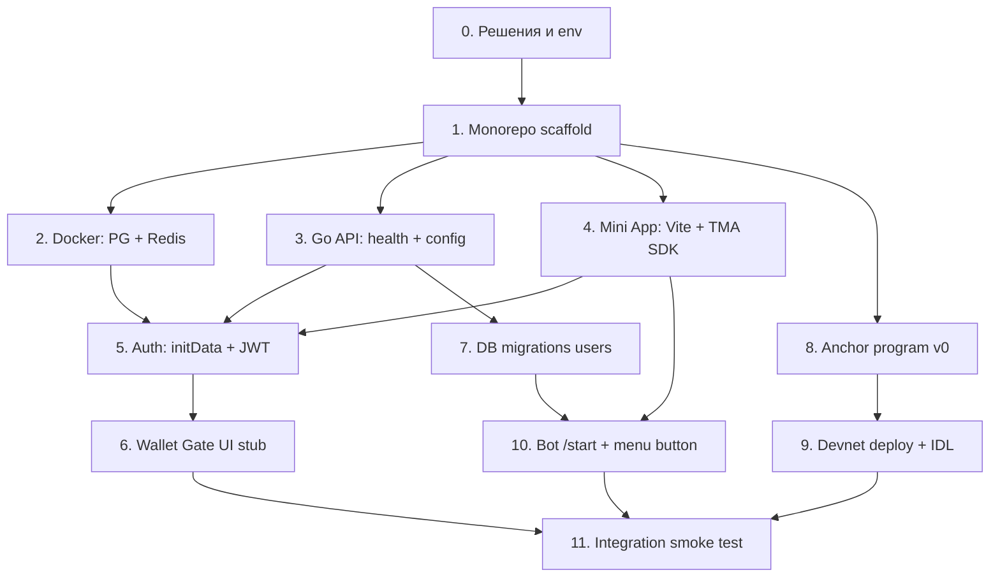

# Phase 0 — Foundation (план реализации)

> **Цель фазы:** поднять скелет monorepo, через который можно открыть Mini App в Telegram, авторизоваться по `initData`, увидеть Wallet Gate (UI), иметь рабочий Go API + миграции БД и задеплоенный escrow-програм на **Solana devnet** (без полного duel loop — это Phase 1).

**Ориентир по срокам:** 2–3 недели (зависит от ответов на блокеры ниже).

---

## Exit criteria (фаза считается завершённой)

- [ ] Monorepo собирается локально одной командой (`make dev` или аналог).
- [ ] Mini App открывается из Telegram (menu button / test link) по HTTPS.
- [ ] `POST /auth/telegram` валидирует `initData`, создаёт пользователя, отдаёт JWT + `wallet_linked`.
- [ ] Wallet Gate блокирует UI без привязанного кошелька (UI stub; полная SIWS — можно Phase 0.5 / Phase 1).
- [ ] PostgreSQL: таблица `users`, `friendships` (минимум); миграции воспроизводимы.
- [ ] Anchor program на devnet: `create_duel`, `accept_duel`, `cancel_duel` + vault; tx проходит в explorer.
- [ ] README: как поднять локально (docker-compose, env vars).

---

## Порядок работ (зависимости)

---

## Задачи по пакетам

### Пакет A — Инфраструктура и репозиторий

| ID | Задача | Deliverable |
|----|--------|-------------|
| A1 | Init monorepo | `go.work`, `apps/miniapp`, `cmd/api`, `cmd/bot`, `programs/clutch-escrow`, `migrations/` |
| A2 | `docker-compose.yml` | PostgreSQL 16, Redis 7 |
| A3 | `.env.example` | Все переменные с комментариями |
| A4 | `Makefile` | `dev`, `migrate-up`, `test`, `anchor-build` |
| A5 | CI skeleton (optional) | GitHub Actions: lint + test Go |

### Пакет B — Go API (`cmd/api`)

| ID | Задача | Deliverable |
|----|--------|-------------|
| B1 | HTTP router (chi/gin), middleware | `GET /health`, structured logging |
| B2 | Config loader | env: `DATABASE_URL`, `JWT_SECRET`, `TELEGRAM_BOT_TOKEN`, `SOLANA_RPC` |
| B3 | PostgreSQL pool (`pgx`) | connection + ping |
| B4 | Migrations | `users`, `friendships` (минимальные поля из ARCHITECTURE) |
| B5 | `POST /auth/telegram` | HMAC initData, upsert user, JWT |
| B6 | `GET /auth/me` | profile + `wallet_linked` |
| B7 | Middleware `wallet_required` | заготовка (403), подключим после SIWS |
| B8 | CORS для Mini App origin | |

### Пакет C — Telegram Bot (`cmd/bot`)

| ID | Задача | Deliverable |
|----|--------|-------------|
| C1 | Webhook или long polling (dev) | `/start`, приветствие |
| C2 | Menu button → Mini App URL | BotFather config documented |
| C3 | Parse `startapp` payload stub | для Phase 1 invites |

### Пакет D — Mini App (`apps/miniapp`)

| ID | Задача | Deliverable |
|----|--------|-------------|
| D1 | Vite + React + TS | базовый проект |
| D2 | Tailwind + design tokens | цвета/шрифты из HTML-спеки |
| D3 | TMA SDK init | theme, expand, BackButton |
| D4 | API client + auth flow | initData → JWT storage |
| D5 | `WalletGate` screen | blocking UI (кнопки кошельков — stub или Phantom only) |
| D6 | Placeholder «Лента» | после gate (пустой shell) |

### Пакет E — Solana Program

| ID | Задача | Deliverable |
|----|--------|-------------|
| E1 | Anchor workspace init | `programs/clutch-escrow` |
| E2 | `Duel` account + vaults | PDA layout из ARCHITECTURE |
| E3 | Instructions v0 | `create_duel`, `accept_duel`, `cancel_duel` |
| E4 | Devnet deploy script | program id в `.env` |
| E5 | IDL + TS types export | для Phase 1 miniapp tx |

### Пакет F — Документация

| ID | Задача | Deliverable |
|----|--------|-------------|
| F1 | `README.md` | quickstart |
| F2 | Обновить ARCHITECTURE | program id, URLs после deploy |

---

## Вне scope Phase 0 (откладываем)

- Полный SIWS / wallet link on-chain tx
- Duel UI, chat, feed content
- AI, admin panel, indexer
- Mainnet
- S3 / proofs upload

---

## Риски и блокеры

| Блокер | Без чего не стартует |
|--------|----------------------|
| Нет Telegram Bot Token | Auth, bot, TMA test |
| Нет HTTPS URL для Mini App | Тест в реальном Telegram |
| Нет Solana devnet wallet | Deploy program |
| Не выбран chi vs gin | Go API scaffold |

---

## Открытые решения (нужны ответы)

См. таблицу вопросов в конце — ответы вносим в этот файл и в `ARCHITECTURE.md` при необходимости.

---

## Решения (2026-05-24)

| Тема | Решение |
|------|---------|
| Бот | @clutch_game_bot |
| Домен | Заглушки в `.env`, один `PUBLIC_URL` на VPS |
| BotFather | Настраивает пользователь |
| Webhook | Production (telebot Webhook) |
| Repo | github.com/GalahadKingsman/clutch |
| Backend | Go 1.25+, chi, golang-migrate |
| DB | Docker PostgreSQL |
| Redis | В compose (задел) |
| Mini App deploy | `make deploy-miniapp` (Vite → nginx volume) |
| Backend deploy | `make deploy-backend` (docker compose) |
| Wallet Gate | Blocking + реальный Phantom SIWS |
| Поиск | telegram_username + имя TG + contact_alias |

---

## Changelog

| Дата | Изменение |
|------|-----------|
| 2026-05-24 | Первая версия плана Phase 0 |
| 2026-05-24 | Реализация scaffold начата (monorepo) |
